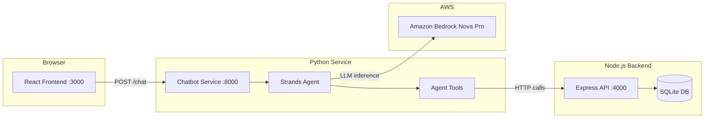
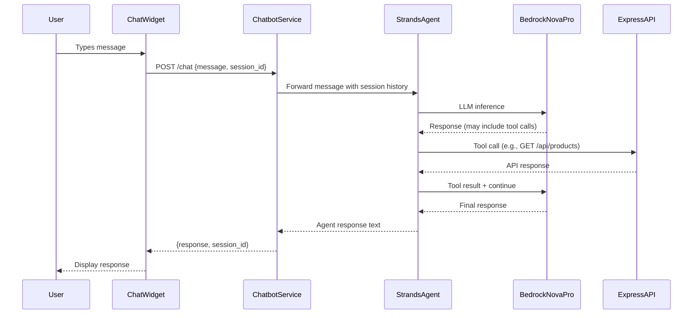

# Design Document: Shopping Assistant Chatbot

## Overview

The Shopping Assistant Chatbot adds an AI-powered conversational interface to the Emoji Shop e-commerce application. It is implemented as two main pieces:

1. A standalone Python HTTP service (`chatbot/`) using the Strands Agents SDK with Amazon Bedrock Nova Pro as the LLM. This service exposes a REST API for chat interactions and uses agent tools to call the existing Express.js backend API for product and cart operations.
2. A floating popup chat widget (`ChatWidget`) embedded in the React frontend that communicates with the Python service.

The Python service runs on port 8000 (configurable), maintains in-memory conversation sessions, and delegates all shop operations to the existing Express.js backend on port 4000. No changes are required to the existing backend or database schema.



## Architecture

### Service Topology

The chatbot introduces a new Python service alongside the existing Node.js stack:

| Service | Port | Technology | Role |
|---------|------|------------|------|
| React Frontend | 3000 | React 18, CRA | UI + Chat Widget |
| Express Backend | 4000 | Node.js, Express, SQLite | Product/Cart API |
| Chatbot Service | 8000 | Python, Strands Agents SDK | AI Chat API |

### Request Flow



### Authentication Strategy

The chatbot service supports two AWS authentication modes, checked at startup:

1. **IAM Credentials**: `AWS_ACCESS_KEY_ID` + `AWS_SECRET_ACCESS_KEY` (+ optional `AWS_SESSION_TOKEN`)
2. **Bearer Token**: `AWS_BEARER_TOKEN_BEDROCK` for Bedrock-specific token auth

If neither is set, the service exits with a descriptive error. The Strands Agents SDK handles credential passing to Bedrock internally via boto3.

## Components and Interfaces

### Python Chatbot Service (`chatbot/`)

#### File Structure

```
chatbot/
├── requirements.txt       # Python dependencies
├── app.py                 # HTTP server, endpoints, CORS, startup logic
├── agent.py               # Strands Agent creation, system prompt, tool registration
├── tools.py               # Agent tool functions (product search, cart ops)
└── sessions.py            # In-memory session store
```

#### HTTP Endpoints

| Method | Path | Request Body | Response | Description |
|--------|------|-------------|----------|-------------|
| POST | /chat | `{message: string, session_id?: string}` | `{response: string, session_id: string}` | Send message, get agent response |
| GET | /health | — | `{status: "ok"}` | Health check |

#### `app.py` — HTTP Server

- Uses Python's built-in `http.server` or a lightweight framework (Flask is not required; the `http.server` module with JSON handling suffices, but Flask is simpler and a common choice with Strands examples).
- Decision: Use **Flask** for simplicity, CORS via `flask-cors`.
- Validates `message` field on POST /chat (returns 400 if missing/empty).
- Catches agent errors and returns 500 with descriptive message.
- Reads port from `CHATBOT_PORT` env var (default 8000).
- Checks AWS credentials at startup; exits with error if missing.

#### `agent.py` — Agent Configuration

- Creates a `strands.Agent` instance with:
  - `model_id`: `us.amazon.nova-pro-v1:0` via `BedrockModel`
  - `system_prompt`: Shopping assistant persona (see Requirement 6)
  - `tools`: List of tool functions from `tools.py`
- Exposes a function `get_agent_response(message, history)` that invokes the agent with conversation context and returns the response text.

#### `tools.py` — Agent Tools

Each tool is a Python function decorated with `@tool` from the Strands SDK. Tools call the Express backend via `requests` (or `urllib`). Decision: Use **requests** for clarity.

| Tool Function | Backend Call | Purpose |
|---------------|-------------|---------|
| `get_products()` | `GET http://localhost:4000/api/products` | List all products |
| `get_product_details(product_id)` | `GET http://localhost:4000/api/products/{id}` | Get product + reviews |
| `get_cart()` | `GET http://localhost:4000/api/cart` | View cart contents |
| `add_to_cart(product_id, quantity)` | `POST http://localhost:4000/api/cart` | Add item to cart |
| `update_cart_item(cart_item_id, quantity)` | `PUT http://localhost:4000/api/cart/{id}` | Update quantity |
| `remove_from_cart(cart_item_id)` | `DELETE http://localhost:4000/api/cart/{id}` | Remove item |

Each tool handles HTTP errors from the backend and returns a descriptive error string so the agent can relay it to the user.

#### `sessions.py` — Session Management

- Stores sessions in a Python `dict`: `{session_id: [message_history]}`
- `get_or_create_session(session_id)` → returns `(session_id, history)`. If `session_id` is `None` or not found, creates a new session with a UUID.
- `append_to_session(session_id, role, content)` → appends a message to the session history.
- No TTL or cleanup (in-memory, lost on restart — acceptable per requirements).

### React Chat Widget (`client/src/components/ChatWidget.js`)

A self-contained React component rendered in `App.js`:

- Floating button (fixed position, bottom-right corner)
- Toggles a popup chat panel on click
- Maintains `messages` array and `sessionId` in component state
- Sends POST to `http://localhost:8000/chat` with `{message, session_id}`
- Shows loading indicator while waiting for response
- Displays error message in chat if service is unreachable or returns error
- Scrollable message history with user/assistant message styling

### Integration Points

- `App.js` imports and renders `<ChatWidget />` alongside existing routes (no changes to routing)
- `App.css` gets additional styles for the chat widget (or a separate CSS file)
- Root `package.json` updated to include chatbot service in `dev` script via `concurrently`

## Data Models

### Chat Request (Frontend → Chatbot Service)

```json
{
  "message": "string (required, non-empty)",
  "session_id": "string (optional, UUID)"
}
```

### Chat Response (Chatbot Service → Frontend)

```json
{
  "response": "string",
  "session_id": "string (UUID)"
}
```

### Error Response

```json
{
  "error": "string (descriptive message)"
}
```

### Session Store (In-Memory)

```python
# sessions dict structure
{
    "uuid-string": [
        {"role": "user", "content": "Show me electronics"},
        {"role": "assistant", "content": "Here are our electronics..."},
        ...
    ]
}
```

### Existing Data Models (Unchanged)

The chatbot reads from the existing SQLite schema via the Express API. No schema changes needed.

| Table | Fields | Used By Tools |
|-------|--------|---------------|
| `products` | id, name, emoji, description, price, category | `get_products`, `get_product_details` |
| `reviews` | id, product_id, author, rating, comment, created_at | `get_product_details` |
| `cart_items` | id, product_id, quantity | `get_cart`, `add_to_cart`, `update_cart_item`, `remove_from_cart` |


## Correctness Properties

*A property is a characteristic or behavior that should hold true across all valid executions of a system — essentially, a formal statement about what the system should do. Properties serve as the bridge between human-readable specifications and machine-verifiable correctness guarantees.*

### Property 1: Chat endpoint returns well-formed responses

*For any* valid non-empty message string and any optional session_id, POSTing to `/chat` should return HTTP 200 with a JSON body containing a `response` field (non-empty string) and a `session_id` field (valid UUID string).

**Validates: Requirements 2.1, 2.2**

### Property 2: Empty or missing messages are rejected

*For any* request body where the `message` field is missing, is an empty string, or consists entirely of whitespace, the `/chat` endpoint should return HTTP 400 with a JSON body containing an `error` field.

**Validates: Requirements 2.3**

### Property 3: Session history round-trip

*For any* session and any sequence of N messages sent to that session, the session history should contain exactly 2×N entries (one user, one assistant per exchange), and sending a subsequent message with the same `session_id` should provide the full prior history as context to the agent.

**Validates: Requirements 3.1, 3.4**

### Property 4: New session creation on missing session_id

*For any* request that omits `session_id` or provides a `session_id` that does not exist in the store, the service should create a new session and return a valid UUID as `session_id` in the response, and that UUID should differ from any previously issued session IDs.

**Validates: Requirements 3.2, 3.5**

### Property 5: Product details tool returns product with reviews

*For any* valid product ID that exists in the backend, calling the `get_product_details` tool should return a JSON object containing the product's `name`, `emoji`, `price`, `description`, and a `reviews` array.

**Validates: Requirements 4.2**

### Property 6: Tool error handling on backend failure

*For any* tool function (product or cart), when the backend API returns an HTTP error status or is unreachable, the tool should return a string containing an error description rather than raising an unhandled exception.

**Validates: Requirements 4.5, 5.6**

### Property 7: Cart operation tools call correct endpoints

*For any* valid product ID and positive quantity, the `add_to_cart` tool should successfully POST to the backend; for any valid cart item ID and positive quantity, the `update_cart_item` tool should successfully PUT to the backend; and for any valid cart item ID, the `remove_from_cart` tool should successfully DELETE from the backend. In each case, the tool should return a result indicating success.

**Validates: Requirements 5.2, 5.3, 5.4**

### Property 8: Chat panel toggle

*For any* sequence of N clicks on the chat button, the chat panel should be open if N is odd and closed if N is even (starting from closed).

**Validates: Requirements 7.2, 7.3**

### Property 9: Message submission persists session ID

*For any* sequence of messages submitted through the chat widget, after the first response is received, all subsequent requests should include the same `session_id` that was returned in the first response.

**Validates: Requirements 7.6, 7.9**

## Error Handling

### Chatbot Service Errors

| Error Scenario | HTTP Status | Response | Handling |
|---------------|-------------|----------|----------|
| Missing/empty `message` field | 400 | `{"error": "message field is required and must be non-empty"}` | Validate before agent invocation |
| Invalid JSON body | 400 | `{"error": "Invalid JSON in request body"}` | Catch JSON parse errors |
| Agent processing error | 500 | `{"error": "Failed to process message"}` | Catch exceptions from Strands Agent |
| Missing AWS credentials at startup | — | Exit with stderr message | Check env vars before starting server |

### Tool Error Handling

Each tool function wraps its HTTP call in a try/except block:

- **Backend HTTP error (4xx/5xx)**: Return a descriptive string like `"Error: Could not retrieve products (status 500)"` so the agent can relay it to the user.
- **Connection error (backend unreachable)**: Return `"Error: The shop service is currently unavailable. Please try again later."`.
- Tools never raise exceptions to the agent — they always return strings.

### Frontend Error Handling

| Error Scenario | UI Behavior |
|---------------|-------------|
| Chatbot service unreachable | Display "Sorry, the assistant is currently unavailable. Please try again later." in chat |
| HTTP error from chatbot | Display "Something went wrong. Please try again." in chat |
| Network timeout | Display timeout message after 30 seconds |
| Empty response from service | Display generic error message |

### CORS Errors

The chatbot service configures `flask-cors` to allow origin `http://localhost:3000`. If the frontend origin changes, the CORS configuration must be updated.

## Testing Strategy

### Dual Testing Approach

This feature uses both unit tests and property-based tests for comprehensive coverage:

- **Unit tests**: Verify specific examples, edge cases, integration points, and error conditions
- **Property-based tests**: Verify universal properties across randomly generated inputs

### Property-Based Testing Configuration

- **Python**: Use `hypothesis` library for property-based testing of the chatbot service
- **JavaScript/React**: Use `fast-check` library for property-based testing of the chat widget
- Each property test runs a minimum of **100 iterations**
- Each property test is tagged with a comment referencing the design property:
  - Format: `Feature: shopping-assistant-chatbot, Property {number}: {property_text}`
- Each correctness property is implemented by a **single** property-based test

### Python Service Tests

**Unit Tests** (pytest):
- Health endpoint returns `{"status": "ok"}` with HTTP 200
- Chat endpoint with valid message returns response and session_id
- Chat endpoint with missing credentials exits with error
- CORS headers present in responses
- Agent is initialized with correct model ID and system prompt
- Individual tool functions return expected data when backend is mocked

**Property-Based Tests** (hypothesis):
- Property 1: Chat endpoint response shape — generate random non-empty strings as messages, verify response structure
- Property 2: Empty/missing message rejection — generate whitespace-only strings and empty strings, verify 400 response
- Property 3: Session history round-trip — generate random message sequences, verify history length and content
- Property 4: New session creation — generate random/nonexistent session IDs, verify new UUID returned
- Property 5: Product details tool — generate valid product IDs, verify response contains required fields
- Property 6: Tool error handling — simulate backend errors for each tool, verify error string returned
- Property 7: Cart operation tools — generate valid product IDs and quantities, verify correct backend calls

### React Widget Tests

**Unit Tests** (React Testing Library):
- Chat button renders on the page
- Clicking button opens chat panel
- Input field and send button are present
- Loading indicator appears during request
- Error message displays on service failure
- Messages render in chat history

**Property-Based Tests** (fast-check):
- Property 8: Chat panel toggle — generate random click sequences, verify panel state
- Property 9: Session persistence — generate message sequences, verify session_id reuse

### Test File Locations

```
chatbot/
├── tests/
│   ├── test_app.py           # Unit + property tests for endpoints
│   ├── test_tools.py         # Unit + property tests for agent tools
│   └── test_sessions.py      # Unit + property tests for session management

client/src/
├── components/
│   └── __tests__/
│       └── ChatWidget.test.js  # Unit + property tests for chat widget
```
